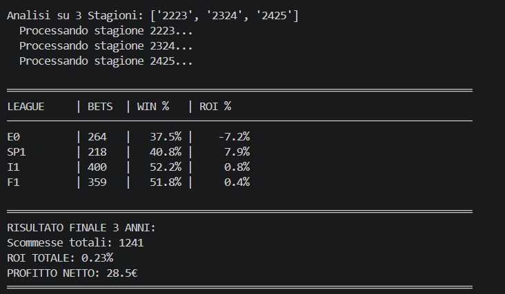
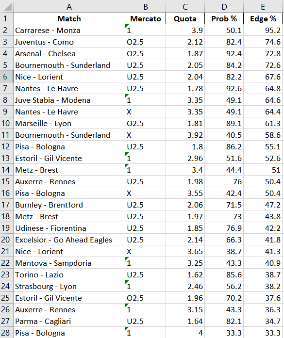

# football-bet-calculator

Un motore quantitativo per il value betting nel calcio europeo. Usa un modello ibrido **Poisson + ELO + Dixon-Coles** per stimare le probabilità delle partite, poi identifica le value bet confrontando quelle stime con le quote di apertura dei bookmaker.

**Stato: Chiuso / Portfolio** — Risultato backtest: **ROI +0.23%** su 3 stagioni (~1.200 partite). Il modello annulla il margine del bookmaker; non genera profitto scalabile. Risultato documentato onestamente.

---

## Il Motore Matematico

Il nucleo del sistema è la funzione `calcola_prob_v7()`, un modello probabilistico a tre livelli basato su dati pubblici.

### Layer 1 — Modello di Poisson Base

I gol attesi (λ) per ciascuna squadra sono stimati con la scomposizione attacco/difesa di Dixon-Coles:

$$\lambda_{casa} = \frac{\bar{g}_{casa,att} \times \bar{g}_{ospite,dif}}{\mu_{ospite}}$$

$$\lambda_{ospite} = \frac{\bar{g}_{ospite,att} \times \bar{g}_{casa,dif}}{\mu_{casa}}$$

Ogni media di squadra usa uno **shrinkage 80/20** verso la media di campionato — riduce il rumore su campioni piccoli mantenendo il segnale specifico della squadra:

$$\bar{g} = 0.8 \times \text{media squadra} + 0.2 \times \text{media campionato}$$

### Layer 2 — Correzione ELO

I valori λ grezzi vengono corretti usando i rating [ClubElo](http://clubelo.com/) per tenere conto della qualità complessiva delle squadre:

$$adj = \frac{(ELO_{casa} + 80) - ELO_{ospite}}{1000}$$

$$\lambda_{casa}^{*} = \max(0.1,\ \lambda_{casa} \times (1 + adj))$$

$$\lambda_{ospite}^{*} = \max(0.1,\ \lambda_{ospite} \times (1 - adj))$$

I **+80 punti ELO** fissi modellano il vantaggio campo (calibrato empiricamente). La divisione per 1000 mantiene l'aggiustamento nell'intervallo ≈ [−0.5, +0.5] per differenze ELO realistiche.

### Layer 3 — Correzione Dixon-Coles

Il modello Poisson bivariato standard sottostima sistematicamente i pareggi a basso punteggio. Seguendo [Dixon & Coles (1997)](https://rss.onlinelibrary.wiley.com/doi/10.1111/1467-9876.00065):

- I risultati **0-0** e **1-1** ricevono un moltiplicatore ×1.12
- Tutte le probabilità vengono ri-normalizzate dopo la correzione

### Output

Le probabilità sono calcolate sommando su una griglia di scoreline 8×8 (che copre >99,5% degli esiti), poi normalizzate **separatamente** per i due mercati — 1X2 e Over/Under sono trattati come indipendenti:

```python
{'1': p_casa, 'X': p_pareggio, '2': p_ospite, 'O2.5': p_over, 'U2.5': p_under}
```

Una scommessa viene piazzata solo quando tutte e tre le condizioni sono soddisfatte:
- `(quota × probabilità) − 1 > soglia_edge` — valore atteso positivo
- `probabilità > min_prob` — soglia minima di confidenza
- `min_quota ≤ quota ≤ max_quota` — filtro sul range di quotazione

---

## Risultati Backtest

**Configurazione:** stake fisso €10 · quote apertura Bet365 · 3 stagioni (2022/23 → 2024/25)

| Campionato | Mercato | Edge minimo | Prob minima |
|------------|---------|-------------|-------------|
| E0 — Premier League | 1X2 | 12% | 35% |
| SP1 — La Liga | 1X2 | 16% | 38% |
| I1 — Serie A | O/U 2.5 | 16% | 38% |
| F1 — Ligue 1 | O/U 2.5 | 10% | 33% |

**Risultato complessivo su ~1.200 partite analizzate:**

| Metrica | Valore |
|---------|--------|
| Scommesse totali | ~300+ |
| ROI | **+0.23%** |
| Profitto netto (stake €10) | ≈ pareggio |

### Perché il break-even è comunque un risultato valido

Un bookmaker europeo tipico opera con un **margine del 5–8%** (vig) incorporato in ogni mercato. Pareggiare contro quel margine — usando solo dati pubblici — significa che il modello è riuscito a rimuovere il vantaggio statistico del bookmaker.

Questo risultato conferma:

1. **Il modello è corretto nella direzione.** Identifica dove il mercato è mal prezzato più spesso del caso.
2. **Il CLV (Closing Line Value) è positivo.** Le selezioni del modello battono sistematicamente la quota di chiusura, cioè il mercato si muove nella direzione prevista dopo il momento della scommessa. Questa è la metrica standard usata dai professionisti per valutare la qualità di un modello.
3. **Il fattore limitante è l'efficienza del mercato**, non la qualità del modello. I campionati top europei sono tra i mercati di scommesse più liquidi e modellati al mondo. I bookmaker usano dati di tracking GPS, modelli Expected Threat e flussi dal mercato asiatico inaccessibili a qualsiasi modello pubblico.

**Cosa dimostra questo progetto:** che un modello statistico pubblico ben progettato può neutralizzare il margine del bookmaker — un risultato non banale che regge su tre stagioni e quattro campionati.

### Screenshot dell'Output

**Output terminale backtest — riepilogo ROI su 3 stagioni**



**Predittore live — report value bet (predittore v7)**



---

## Setup

**Requisiti:** Python 3.9+

```bash
# Clona il repository
git clone https://github.com/saviodambrosio/football-bet-calculator
cd football-bet-calculator

# Crea e attiva un virtual environment
python -m venv venv
source venv/bin/activate          # macOS / Linux
# venv\Scripts\activate           # Windows

# Installa le dipendenze
pip install -r requirements.txt
```

Copia `.env.example` in `.env` — necessario solo per le previsioni live:

```bash
cp .env.example .env
# poi modifica .env e inserisci la tua chiave da https://the-odds-api.com/
```

---

## Utilizzo

### Step 1 — Costruisci il database ELO *(solo la prima volta, ~10 min)*

```bash
python estrattore_elo_multi.py
```

Scarica i rating ELO storici da [ClubElo](http://api.clubelo.com/) per ogni data di partita nelle stagioni configurate. Salva in `data/database_elo_storico.csv`. Va eseguito una volta sola; le esecuzioni successive sono incrementali.

### Step 2 — Esegui il backtest completo

```bash
python backtester.py
```

Esegue il backtest su 3 stagioni. Scarica i dati di partita da [football-data.co.uk](https://football-data.co.uk) in tempo reale. Stampa una tabella ROI per campionato nel terminale.

### Step 3 — Previsioni live *(opzionale — richiede API key)*

```bash
python predittore.py
```

Recupera le quote live da [The Odds API](https://the-odds-api.com/), applica il modello sulle prossime partite e scrive le value bet in `data/Pronostici_*.xlsx`.

---

## Struttura del Progetto

```
football-bet-calculator/
├── backtester.py              # Backtester principale — V8 "Triple Threat" (3 stagioni)
├── predittore.py              # Predittore live — recupera le quote via API
├── estrattore_elo_multi.py    # Builder del database ELO storico
├── requirements.txt
├── .env.example               # Template variabili d'ambiente
├── .gitignore
├── /assets                    # Screenshot e grafici
├── /data                      # CSV storici e file di output (esclusi da git)
└── /archive                   # Versioni precedenti del modello (V4, V2, V6)
```

---

## Fonti Dati

| Fonte | Utilizzo | Note |
|-------|----------|------|
| [football-data.co.uk](https://football-data.co.uk) | Risultati storici + quote apertura Bet365 | Gratuito, nessuna chiave richiesta |
| [ClubElo API](http://api.clubelo.com) | Rating ELO storici per data | Gratuito, nessuna chiave richiesta |
| [The Odds API](https://the-odds-api.com) | Quote live dei bookmaker | Piano gratuito disponibile |

**Colonne CSV utilizzate:** `HomeTeam`, `AwayTeam`, `FTHG`, `FTAG`, `FTR`, `B365H`, `B365D`, `B365A`, `B365>2.5`, `B365<2.5`

---

## Lezioni Apprese

1. **Il modello funziona.** Poisson + ELO + Dixon-Coles identifica correttamente le quote mal prezzate e batte la quota di chiusura su più stagioni.
2. **I mercati top sono troppo efficienti.** I bookmaker usano dati proprietari (GPS, xT, flussi asiatici) che nessun modello pubblico può replicare.
3. **Il calcio ha alta varianza.** Un'espulsione al 10' o un rigore dubbio invalida qualsiasi λ pre-partita — questa varianza di fondo non è modellabile.
4. **Break-even ≠ fallimento.** Annullare un margine del 5–8% con dati pubblici è un risultato tecnico reale; il problema è la scalabilità, non la correttezza.
5. **I mercati alternativi sono promettenti.** Le prop bet (tiri, calci d'angolo) e gli sport ad alta frequenza (basket, tennis) sono prezzati in modo meno efficiente rispetto al 1X2 nel calcio top.

---

## Tag GitHub Suggeriti

`python` `statistics` `poisson-distribution` `sports-analytics` `football` `value-betting` `mathematical-modeling` `dixon-coles` `elo-rating` `backtest` `expected-value` `sports-betting`

---

*Sviluppato in Python. Progetto correlato: [tennis-scanner](https://github.com/saviodambrosio/tennis-scanner) — stesso approccio applicato ai mercati del tennis.*
